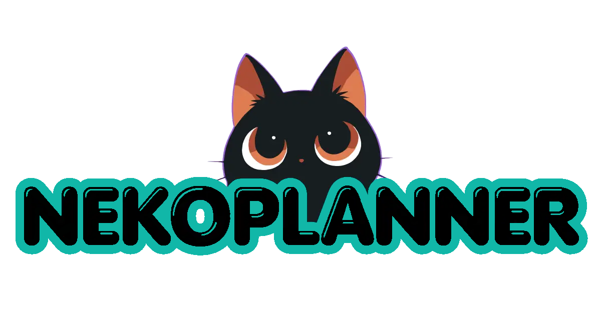

<div align="center">
  
</div>


**Planificá, organizá y visualizá tu contenido para redes sociales desde un solo lugar.**

NekoPlanner es una aplicación **open source y local-first** para planificar contenido de redes sociales mediante un calendario visual, organizar ideas y tener una visión general de tu estrategia de contenido.

Construida con **Angular 19**, Signals y una arquitectura orientada a features.

> 🚧 NekoPlanner se encuentra actualmente en desarrollo activo.

---

## ✨ Features

### 📊 Dashboard

Una vista general de todo tu contenido:

* Métricas de publicaciones.
* Publicaciones programadas.
* Publicaciones del mes.
* Ideas.
* Distribución por plataforma.
* Distribución por estado.
* Próximas publicaciones.

### 📅 Calendar

Calendario visual para organizar publicaciones por fecha.

* Vista mensual.
* Navegación entre meses.
* Publicaciones por día.
* Plataformas y estados visuales.
* Drag & Drop planificado para futuras iteraciones.

### 📝 Posts

Gestión de publicaciones:

* Título.
* Contenido.
* Plataforma.
* Estado.
* Fecha y hora.
* Tags.
* Media.

### 💡 Ideas

Un espacio para capturar y organizar ideas de contenido antes de convertirlas en publicaciones.

### 📈 Analytics

Visualización y análisis de la distribución del contenido.

### ⚙️ Settings

Configuración de la aplicación y gestión de datos locales.

---

## 🎯 Why NekoPlanner?

NekoPlanner está diseñado con tres principios principales:

**Local-first**

Tus datos pertenecen al usuario y la aplicación puede funcionar sin depender de un backend.

**Open source**

El código es público y puede ser estudiado, utilizado y extendido por la comunidad.

**Simple by design**

La aplicación prioriza una arquitectura clara y mantenible en lugar de añadir complejidad innecesaria.

---

## 🧱 Tech Stack

| Tecnología            | Uso                                 |
| --------------------- | ----------------------------------- |
| Angular 19            | Framework                           |
| TypeScript            | Lenguaje                            |
| Angular Signals       | Estado reactivo                     |
| RxJS                  | Flujos reactivos cuando corresponde |
| Angular CDK           | Interacciones como Drag & Drop      |
| SCSS                  | Estilos                             |
| CSS Custom Properties | Design System                       |
| date-fns              | Manejo de fechas                    |
| pnpm                  | Package manager                     |

---

## 🏗️ Architecture

NekoPlanner utiliza una arquitectura **feature-oriented** basada en Angular Standalone Components.

```text
src/app/
├── core/
│   ├── models/
│   ├── data/
│   ├── state/
│   ├── storage/
│   └── utils/
│
├── shared/
│   └── components/
│
├── layout/
│   ├── app-shell/
│   ├── sidebar/
│   ├── topbar/
│   └── mobile-navigation/
│
└── features/
    ├── dashboard/
    ├── calendar/
    ├── posts/
    ├── ideas/
    ├── analytics/
    └── settings/
```

### Core

Contiene modelos de dominio, estado de aplicación, persistencia, datos demo y utilidades compartidas.

### Shared

Contiene componentes UI reutilizables y elementos transversales.

### Layout

Contiene la estructura general de la aplicación.

### Features

Cada dominio funcional mantiene su propia implementación y evita acoplamientos innecesarios.

---

## 🎨 Design System

NekoPlanner utiliza un Design System propio basado en **CSS Custom Properties**.

### Brand

```text
Primary: #14B8A6
```

### Themes

* Light
* Dark

### UI Components

Actualmente:

* Button
* Badge
* Card
* UpcomingPostCard

Los componentes utilizan tokens semánticos para mantener una identidad visual consistente.

---

## 🌎 Language

La interfaz está diseñada para usuarios **hispanohablantes**.

```text
UI → Español
Código → Inglés
```

No se implementó i18n todavía.

---

## 💾 Local-first

NekoPlanner está diseñado para funcionar inicialmente sin backend.

La arquitectura utiliza:

```text
Domain Models
      ↓
App State
      ↓
Storage Service
      ↓
Local Storage
```

Los datos se almacenan utilizando un namespace propio:

```text
nekoplanner:
```

También existe soporte para exportar e importar datos.

---

## 🧪 Development

### Requirements

* Node.js
* pnpm

### Installation

```bash
pnpm install
```

### Development server

```bash
pnpm start
```

La aplicación estará disponible en:

```text
http://localhost:4200
```

### Build

```bash
pnpm build
```

### Tests

```bash
pnpm test
```

---

## 🚀 Roadmap

### v0.1.0 — Foundation

* [x] Project architecture
* [x] Design System
* [x] App Shell & Navigation
* [x] Project documentation

### v0.2.0 — Core & State

* [x] Domain Models
* [x] Application State
* [x] Storage Service
* [x] Demo Dataset

### v0.3.0 — Dashboard

* [x] Dashboard layout
* [x] Computed metrics
* [x] UpcomingPostCard

### v0.4.0 — Calendar

* [x] Calendar domain utilities
* [ ] Monthly calendar UI
* [ ] Calendar filters
* [ ] Drag & Drop scheduling

### Future

* Post management
* Ideas management
* Analytics
* Settings
* Improved data management
* Optional cloud sync
* Team workspaces
* Social platform integrations

---

## 📸 Screenshots

Screenshots del proyecto:

### Dashboard

> Agregar screenshot del Dashboard.

### Calendar

> Agregar screenshot del calendario.

### Mobile

> Agregar screenshot de la experiencia mobile.

---

## 🔗 Links

**Demo:**
`https://TU-DOMINIO`

**GitHub:**
`https://github.com/CinloDev/nekoplanner`

---

## 🤝 Contributing

Las contribuciones son bienvenidas.

Antes de realizar cambios importantes, revisar:

* `PROJECT.md`
* Issues abiertas
* Arquitectura existente
* Convenciones de Git

Las nuevas features deben mantener el enfoque modular y evitar dependencias innecesarias.

---

## 📄 License

NekoPlanner está distribuido bajo la licencia **MIT**.

---

## 👩‍💻 Author

**CinloDev**

Construido con Angular, TypeScript y muchas horas de debugging. 🐱
